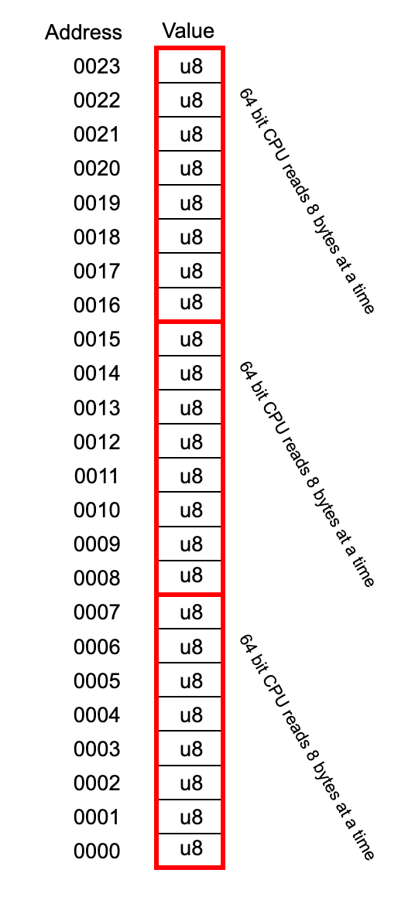

# The stack

> A stack is nothing more than a piece of contiguous memory.

This is important to know. A computer only has memory, it doesn't have a special "stack" memory and a "heap" memory, it's all part of the same memory. 

The difference is how this memory is accessed and used. The stack support simple push/pop instructions on a contiguous part of memory, that's what makes it fast to use. The heap memory is allocated by a memory allocator on demand and can be scattered around in different locations.

We'll not go through the differences between the stack and the heap here, since there are numerous articles explaining them in detail including a chapter in [The Rust Programming Language](https://doc.rust-lang.org/stable/book/ch04-01-what-is-ownership.html#the-stack-and-the-heap).

### What does the stack look like



Let's start with a simplified view of the stack. A 64 bit CPU will read 8 bytes at a time, even though the natural way for us to see a stack is a long line of `u8`so when we pass a pointer we need to make sure we pass inn a pointer to either address `0016`, `0008` or `0000` in the example above. 

The stack grows downwards, so we start at the top and work our way down.

When we set the `stack pointer`in a _16 byte aligned_ stack, we need to make sure to put our stack pointer to an address which is a _multiple of 16_. In the example above, the only address that satisfies this requirement is `0008`\(remember the stack starts on the top\).

If we add the following lines of code to our example in the last chapter just before we do the switch in our main function we can effectively print out our stack and have a look at it:

```rust
for i in (0..SSIZE).rev() {
    println!("mem: {}, val: {}", 
    stack_ptr.offset(i as isize) as usize, 
    *stack_ptr.offset(i as isize))
}
```

The output we get is:

```text
mem: 94846750517871, val: 0
mem: 94846750517870, val: 0
mem: 94846750517869, val: 0
mem: 94846750517868, val: 0
mem: 94846750517867, val: 0
mem: 94846750517866, val: 0
mem: 94846750517865, val: 0
mem: 94846750517864, val: 0
mem: 94846750517863, val: 0
mem: 94846750517862, val: 0
mem: 94846750517861, val: 86
mem: 94846750517860, val: 67
mem: 94846750517859, val: 56
mem: 94846750517858, val: 252
mem: 94846750517857, val: 205
mem: 94846750517856, val: 240
mem: 94846750517855, val: 0
mem: 94846750517854, val: 0
mem: 94846750517853, val: 0
mem: 94846750517852, val: 0
mem: 94846750517851, val: 0
mem: 94846750517850, val: 0
mem: 94846750517849, val: 0
mem: 94846750517848, val: 0
mem: 94846750517847, val: 0
mem: 94846750517846, val: 0
mem: 94846750517845, val: 0
mem: 94846750517844, val: 0
mem: 94846750517843, val: 0
mem: 94846750517842, val: 0
mem: 94846750517841, val: 0
mem: 94846750517840, val: 0
mem: 94846750517839, val: 0
mem: 94846750517838, val: 0
mem: 94846750517837, val: 0
mem: 94846750517836, val: 0
mem: 94846750517835, val: 0
mem: 94846750517834, val: 0
mem: 94846750517833, val: 0
mem: 94846750517832, val: 0
mem: 94846750517831, val: 0
mem: 94846750517830, val: 0
mem: 94846750517829, val: 0
mem: 94846750517828, val: 0
mem: 94846750517827, val: 0
mem: 94846750517826, val: 0
mem: 94846750517825, val: 0
mem: 94846750517824, val: 0
I LOVE WAKING UP ON A NEW STACK!
```

I've printed out the memory addresses as u64 here so it's easier to parse if you're not very familiar with hex. 

The first thing to note is that this is just a contiguous piece of memory, starting at address `94846750517824` and ending on `94846750517871`. 

The addresses `94846750517856`to `94846750517863`is of special interest for us. The first address is the address of our "stack pointer", the value we write to the `%rsp`register of the CPU. The range represents the values we wrote to the stack before we made the switch. 

In other words the values `240, 205, 252, 56, 67, 86, 0, 0` is the pointer to our `hello()`function written as `u8`values.


An interesting side note here is that the order the CPU writes an`u64` as `u8`bytes is dependent on it's endianness. I'll simply refer to the [wikipedia article](https://en.wikipedia.org/wiki/Endianness), but if you try to parse these numbers manually you'll have to bear this in mind.


As we write more complex functions our extremely small 48 byte stack will soon run out of space, you see, as we run functions we write in Rust our code will instruct the CPU to push and pop values on our stack to execute our program.

### Stack sizes

When you start a process in most modern operating systems the standard stack size is normally 8 MB but it can be configured differently, this is enough for most programs but it's up to the programmer to make sure we don't use more than we have. This is the cause of the dreaded "Stack overflow" that most of us have experienced.

However, when we can control the stacks ourselves we can choose the size we want. 8 MB for each context is way more than we need when running simple functions in a web server for example, so by reducing the stack size we can have millions of Green Threads running on a machine, while we run out of memory a lot sooner using stacks provided by the operating system.

### Growable stacks

Some implementations use growable stacks. This lets us allocate a small part of memory that's enough stack space for most tasks, but instead of causing a stack overflow when we use all of our stack it allocates a new an larger stack and moves everything from the stack it outgrew to a new and larger stack where it can resume the program execution.

GO is an example of this. It starts out with a 8 KB stack and when it runs out of space it reallocates to a larger stack. As in every thing in programming this has some trade-offs, all the pointers you have needs to be updated correctly, and this is not an easy task. If you're more interested in how GO handles it's stack \(which is a good example of the use and trade-offs using a growable stack\) I'll refer you to this article: [https://blog.cloudflare.com/how-stacks-are-handled-in-go/](https://blog.cloudflare.com/how-stacks-are-handled-in-go/).


Note one thing that will be important later: We used a normal`Vec<u8>`from Rusts standard library. It is very convenient for us but this have some problems. Among others, we have no guarantee that it will stay in the same location in memory.

As you might understand, if the stack is moved to a different address space our program will crash since all our pointers will be invalid. Something as simple as doing a`push()`to our stack might trigger an expansion and when a`Vec`expands it asks for a new, and larger, piece of memory and moves the values over.


Ok, now that we've gone through the basics of how a stack looks and works and we are ready to move on to implementing our green threads. You've already done much of the hard work so I promise more code now.

## Bonus material

If you are curious enough you might wonder what happens with the stack after we switch over to it?

The answer is that our code written in Rust compiles to instructions for our CPU which then takes over and uses our stack just like any other stack. 

Unfortunately to show this I had to increase the stack size to 1024 bytes to allow for the code to print out the stack itself to get enough space so it's not something we could print out here. 

### Taking a look at the stack

However, I made a altered version of our example that you can run which prints out two text files one `BEFORE.txt`that prints out our stack before we switch over to it and one `AFTER.txt`that prints out the stack after we switched. You can then see for yourself how the stack now is alive and used by our code.


If you see anything you don't recognize in this code, relax, we will go through them thoroughly very soon.


```rust
#![feature(asm)]
#![feature(naked_functions)]
use std::io::Write;

const SSIZE: isize = 1024;
static mut S_PTR: *const u8 = 0 as *const u8;

#[derive(Debug, Default)]
#[repr(C)]
struct ThreadContext {
    rsp: u64,
    r15: u64,
    r14: u64,
    r13: u64,
    r12: u64,
    rbx: u64,
    rbp: u64,
}

fn print_stack(filename: &str) {
    let mut f = std::fs::File::create(filename).unwrap();
    unsafe {
         for i in (0..SSIZE).rev() {
            writeln!(f, "mem: {}, val: {}", S_PTR.offset(i as isize) as usize, *S_PTR.offset(i as isize));
        }
    }   
}

#[naked]
fn hello()  {
    println!("I LOVE WAKING UP ON A NEW STACK!");
    print_stack("AFTER.txt");

    loop {

    }
}

unsafe fn gt_switch(new: *const ThreadContext) {
    asm!("
        mov     0x00($0), %rsp
        ret
       "
    :
    : "r"(new)
    :
    : "alignstack" 
    );
}

fn main() {
    let mut ctx = ThreadContext::default();
    
    let mut stack = vec![0_u8; SSIZE as usize];
    let stack_ptr = stack.as_mut_ptr();

    unsafe {
        S_PTR = stack_ptr;
        std::ptr::write(stack_ptr.offset(SSIZE - 16) as *mut u64, hello as u64);
        print_stack("BEFORE.txt");
        ctx.rsp = stack_ptr.offset(SSIZE - 16) as u64;
        gt_switch(&mut ctx);
    }
}


```

